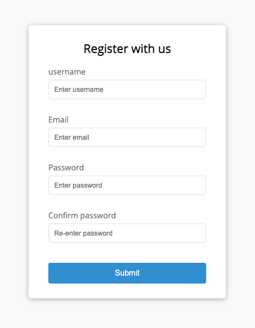

# Vanilla JS Form Validator #

A little JavaScript exercise to implement validation checks on required fields, input length, email (using regex) and password match.
on the commits you can see the process of developing the form and the logic inside my code to then refactor into a more clean code.

